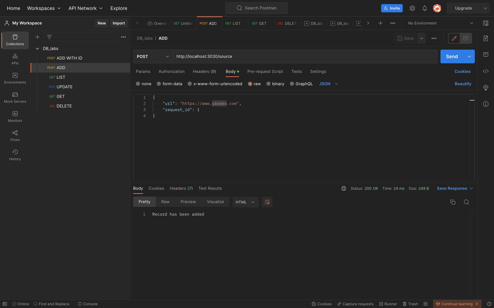
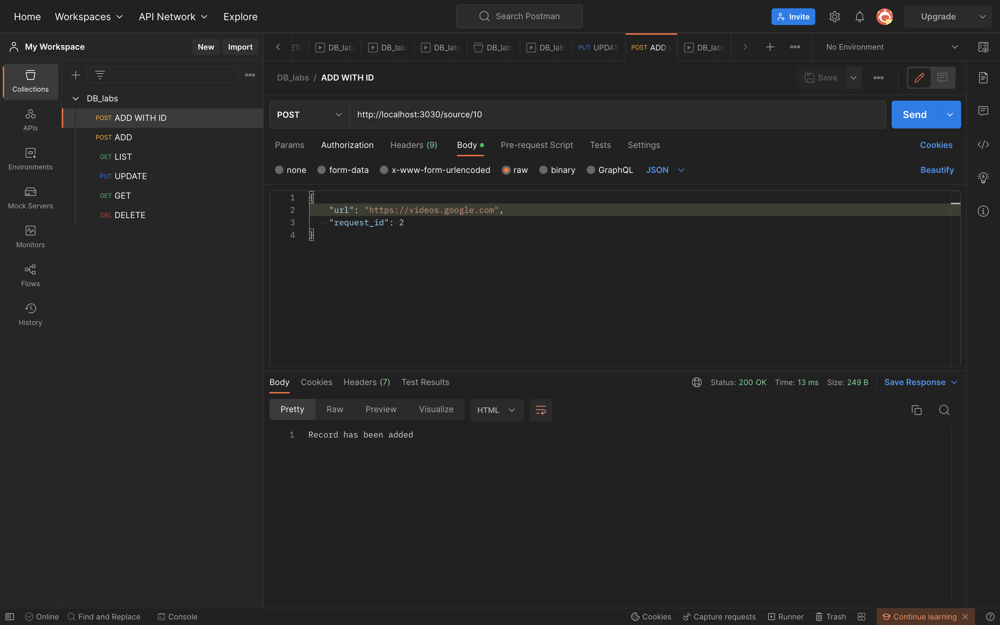
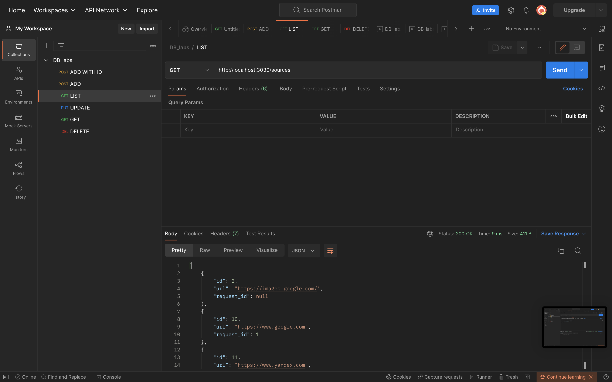
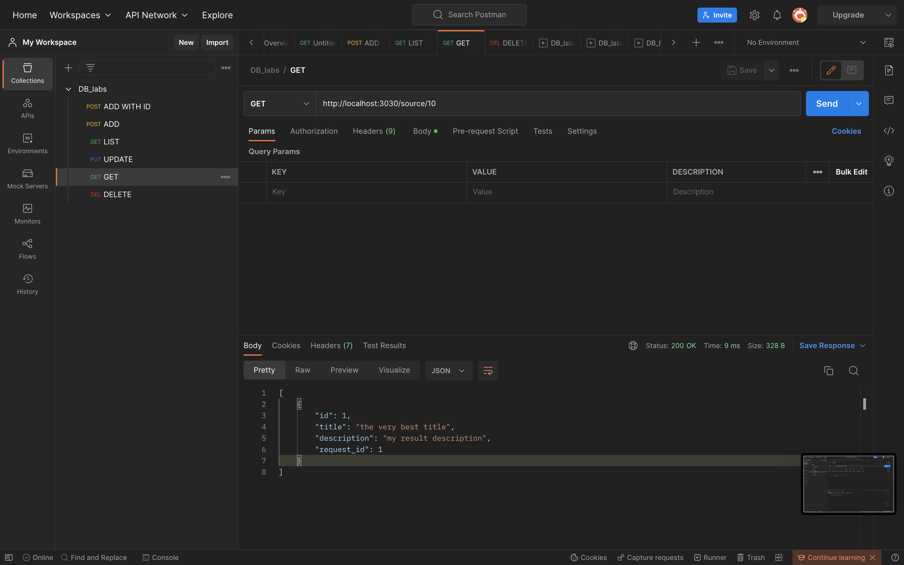
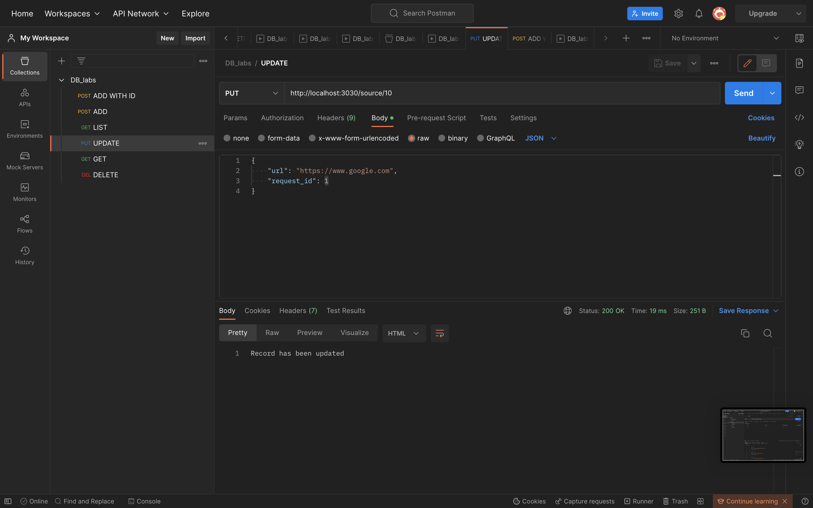
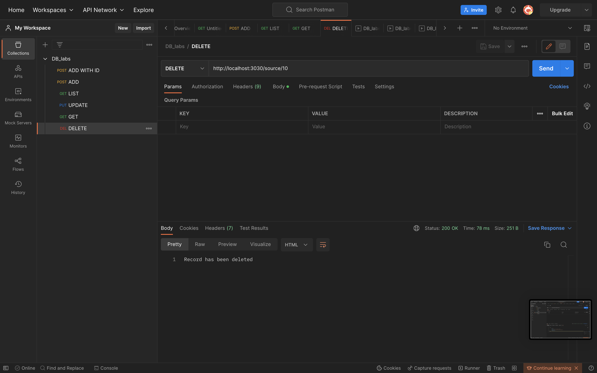

# Тестування працездатності системи

## Основні положення

Тестування відбувається через **Postman** - програмне забезпечення для роботи з API (у тому числі тестування).

Запуск серверу з файлу **start.js**:  

## Тестування REST API

### POST - create

#### Запит

#### Запит по ID

### GET - read

#### Усі елементи

#### Пошук за ID

### PUT - update

#### Запит

### DELETE

#### Запит

